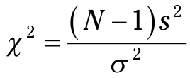

```{r setup, include=FALSE}
# git config --global user.email "madhuvasudevan@yahoo.com"
# git config --global user.name "Madhu Vasudevan"

knitr::opts_chunk$set(echo = TRUE, comment = NA)
```

```{r, message=FALSE}
#install.packages("EnvStats")

#z <- paste(library()$results[,1],library()$results[,2])
#z <- sort(z)
#head(z, 20)

req.lib.pkgs <- c("grDevices", "reshape2", "ggplot2", "EnvStats")
for (req.lib in req.lib.pkgs) {
  if(! req.lib %in% (.packages())){
    library(req.lib, character.only = TRUE)
  }
}  
(.packages())
```

# One-Sample Hypothesis Testing 

## Hypotheses, Tests, and Errors

## Hypothesis Tests and Sampling Distributions 

## Catching Some Z’s Again
```{r}
qnorm(0.05, lower.tail = FALSE)

```

## Z Testing in R
```{r}
z.test = function(x,mu,popsd){
  #one.tail.p <- NULL
  z.score <- round((mean(x)-mu)/(popsd/sqrt(length(x))),3)
  one.tail.p <- round(pnorm(abs(z.score),lower.tail= FALSE),3)
  cat(" z =",z.score,"\n",
  "one-tailed probability =", one.tail.p,"\n",
  "two-tailed probability =", 2*one.tail.p )
}

IQ.data <- c(100,101,104,109,125,116,105,108,110)
mean(IQ.data)
z.test(IQ.data,100,15)

```

## t for One

## t Testing in R
```{r}
?qt

FarKlempt.data <- c(3,6,9,9,4,10,6,4,12)
N <- length(FarKlempt.data)
xbar <- mean(FarKlempt.data)
mu <- 4
pop.sd <- sd(FarKlempt.data)
std.err <- pop.sd/sqrt(N)
alpha = 0.05
lower.CI <- xbar - abs(qt(0.025, df=N-1, lower.tail = TRUE))*std.err
upper.CI <- xbar + abs(qt(0.025, df=N-1, lower.tail = TRUE))*std.err

t.statistic <- round((xbar - mu)/std.err, 3)
p.val <- 2*pt(abs(t.statistic), df=N-1, lower.tail = FALSE)

t.test(FarKlempt.data,mu=4, alternative="two.sided")


```

## Working with t-Distributions
```{r}
t.values <- seq(-4,4,1)
round(dt(t.values, df=12),2)
round(pt(t.values, 12), 2)
quartiles <- c(0, .25, .5, .75, 1)
qt(quartiles, df=12)
round(rt(8, 12), 2)

```

## Visualizing t-Distributions
```{r}
t.values <- seq(-4,4,.1)
plot(x = t.values,y = dt(t.values,df=3), type = "l", lty = "dotted",
  ylim = c(0,.4), xlab = "t", ylab = "f(t)")
lines(t.values,dt(t.values,10),lty = "dashed")
lines(t.values,dnorm(t.values))
legend("topright", title = "df",
       legend = c(expression(infinity),"10","3"), 
       lty = c("solid","dashed","dotted"), bty = "n")

```

### Plotting t in ggplot2
```{r}
t.frame = data.frame(t.values, 
                      df3 = dt(t.values,3),
                      df10 = dt(t.values,10),
                      std_normal = dnorm(t.values))

head(t.frame)
t.frame.melt <- melt(t.frame,id="t.values")
head(t.frame.melt)
colnames(t.frame.melt)= c("t","df","density")
head(t.frame.melt)
x.axis.values <- seq(-4,4,2)

ggplot(t.frame.melt, aes(x=t,y=density,group =df)) +
  geom_line(aes(linetype=df)) +
  scale_x_continuous(breaks=x.axis.values,labels=x.axis.values) +
  scale_linetype_manual(values = c("dotted","dashed","solid"),
    labels = c("3","10", expression(infinity))) +
  guides(linetype=guide_legend(reverse = TRUE)) +
  labs(y="f(t)")

```

## Testing a Variance 
The formula for the chi-square test statistic is:

```{r}
FarKlempt.data2 <- c(12.43, 11.71, 14.41, 11.05, 9.53,11.66,
                     9.33,11.71,14.35,13.81)
varTest(FarKlempt.data2,alternative="greater",
        conf.level=0.95,sigma.squared = 2.25)


```

## Working with Chi-Square Distributions
```{r}
qchisq(.05,df=9,lower.tail = FALSE)
chisq.values <- seq(0,16,2)
round(dchisq(chisq.values,9),3)
round(pchisq(chisq.values,9),3)
round(rchisq(n=6,df=9),3)

```

## Visualizing Chi-Square Distributions

### Plotting chi-square in base R graphics
```{r}
chi.values <- seq(0,25,.1)
plot(x=chi.values, y=dchisq(chi.values,df=4), type = "l",
  xlab=expression(chi^2), ylab="")
mtext(side = 2, text = expression(f(chi^2)), line = 2.5)
lines(x=chi.values,y=dchisq(chi.values,df= 10))
text(x=6,y=.15, label="df=4")
text(x=16, y=.07, label = "df=10")

```

### Plotting chi-square in ggplot2 
```{r}
ggplot(NULL, aes(x=chi.values)) +
  geom_line(aes(y=dchisq(chi.values,4))) +
  geom_line(aes(y=dchisq(chi.values,10))) +
  labs(x=expression(chi^2),y=expression(f(chi^2))) +
  annotate(geom = "text",x=6,y=.15,label="df=4") +
  annotate(geom = "text",x=16,y=.07,label="df=10")

```


## Scratch
```{r, include=FALSE, eval=FALSE, echo=FALSE}
expression(infinity)
```

