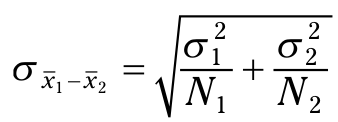
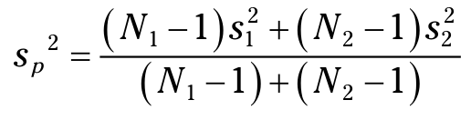
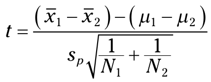
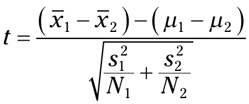
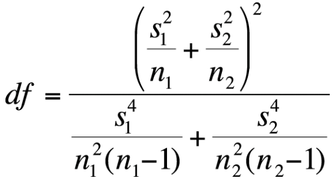
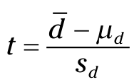
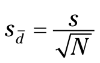

```{r setup, include=FALSE}
# git config --global user.email "madhuvasudevan@yahoo.com"
# git config --global user.name "Madhu Vasudevan"

knitr::opts_chunk$set(echo = TRUE, comment = NA)
```

```{r, message=FALSE}
#install.packages("moments")
#install.packages("tigerstats")

#z <- paste(library()$results[,1],library()$results[,2])
#z <- sort(z)
#head(z, 20)

req.lib.pkgs <- c("ggplot2", "reshape2", "grid")
for (req.lib in req.lib.pkgs) {
  if(! req.lib %in% (.packages())){
    library(req.lib, character.only = TRUE)
  }
}  
(.packages())
```

# Two-Sample Hypothesis Testing 

## Hypotheses Built for Two 

## Sampling Distributions Revisited 

## Applying the central limit theorem 



### Z’s once more    
```{r}
qnorm(0.05, lower.tail = FALSE)
```


### Z-testing for two samples in R 

```{r}
z.test2 <- function(x1,x2,popsd1,popsd2){
#  one.tail.p <- NULL
  std.error <- sqrt((popsd1^2/length(x1) + popsd2^2/length(x2)))
  z.score <- round((mean(x1)-mean(x2))/std.error,3)
  one.tail.p <- round(pnorm(abs(z.score),lower.tail = FALSE),3)
  cat(" mean1 =", mean(x1)," ", "mean2 =", mean(x2), "\n",
  "standard error =", std.error, "\n",
  "z =", z.score,"\n",
  "one-tailed probability =", one.tail.p,"\n",
  "two-tailed probability =", 2 * one.tail.p )
}

sample1 <-c(100,118,97,92,118,125,136,95,111)
sample2 <-c(91,109,83,88,115,108,127,102,86)
z.test2(sample1,sample2,15,15)


```

## t for Two

## Like Peas in a Pod: Equal Variances
Variance Pooling:

t for pooled variances formula is:



## t-Testing in R 
```{r}
machine1 <-c(24.58, 22.09, 23.70, 18.89, 22.02, 28.71,
             24.44,20.91, 23.83, 20.83)
machine2 <- c(21.61, 19.06, 20.72, 15.77, 19, 25.88,
             21.48,17.85, 20.86, 17.77)
t.test(machine1,machine2,var.equal = TRUE, alternative="two.sided", mu=0)


```


### Working with a data frame and a formula
```{r}
prod.time <- c(machine1,machine2)
machine <-c("machine1","machine2")
machine <- rep(machine, times = c(10,10))
FarKlempt.frame <-data.frame(machine,prod.time)
head(FarKlempt.frame)
with (FarKlempt.frame,t.test(prod.time~machine,
                              var.equal = TRUE,
                              alternative="two.sided",
                              mu=0))

```


### Visualizing the results


### Boxplots
```{r}
with (FarKlempt.frame,
      boxplot(prod.time~machine, 
              xlab = "Machine", ylab="Production Time (minutes)"))
ggplot(FarKlempt.frame, aes(x=machine, y=prod.time))+
  stat_boxplot(geom="errorbar", width =.5) +
  geom_boxplot()
```


## Bar graphs
```{r}
machine.names <-c("machine1","machine2")
mean.times <- c(mean(machine1),mean(machine2))
se.times <- c(sd(machine1)/sqrt(length(machine1)),
              sd(machine2)/sqrt(length(machine2)))
FKmeans.frame <-data.frame(machine.names,mean.times,se.times)
FKmeans.frame

ggplot(FKmeans.frame, aes(x=machine.names, y=mean.times))+
  geom_bar(stat="identity", width=.4,color="black",fill="white")+
  geom_errorbar(aes(ymin=mean.times-se.times,ymax=mean.times+se.times),
              width=.1) 
```

### Like p’s and q’s: Unequal variances
t test formula for comparison of 2 sample means with unequal variances:


Degrees of freedom formula    
for comparison of 2 sample means with unequal variances: 


```{r}
with (FarKlempt.frame,t.test(prod.time~machine,
                              var.equal = FALSE,
                              alternative="two.sided",
                              mu=0))

```

## A Matched Set: Hypothesis Testing for Paired Samples
Paired samples t-test formula:


where standard error of the differences is:


### Paired Sample t-testing in R
```{r}
before <-c(198,201,210,185,204,156,167,197,220,186)
after <- c(194,203,200,183,200,153,166,197,215,184)
t.test(before,after,alternative = "greater",paired=TRUE)

```

## Testing Two Variances

### F-testing in R
```{r}
m1.parts <- rnorm(10, 20, 0.9)
sd(m1.parts)
m2.parts <- rnorm(15, 20, 0.8)
sd(m2.parts)

var.test(m1.parts,m2.parts,ratio=1,alternative="two.sided")
```

## Working with F-Distributions
```{r}
qf(.025,9,14,lower.tail = FALSE)
F.scores <-seq(0,5,1)
round(df(F.scores,9,14),3)
round(pf(F.scores,9,14),3)
rf(5,9,14)

```

## Visualizing F-Distributions
```{r}
F.values <-seq(0,5,.05)
F5.15 <- df(F.values,5,15)
F10.20 <- df(F.values,10,20)
F.frame <- data.frame(F.values,F5.15,F10.20)
head(F.frame)
F.frame.melt <- melt(F.frame,id="F.values")
colnames(F.frame.melt)=c("F","deg.fr","density")

ggplot(F.frame.melt,aes(x=F,y=density,group=deg.fr)) +
  geom_line(stat="identity",aes(linetype=deg.fr))+
  scale_linetype_manual(values = c("solid","dashed"),
  labels = c("5,15","10,20")) +
  guides(linetype=FALSE) +
  annotate(geom="text",x=1.98,y=.78,label="df=10,20")+
  annotate(geom="segment",x=2.0,y=0.75,xend=1.15,yend=.6,arrow=arrow())+
  annotate(geom="text",x=3.3,y=.28,label="df=5,15")+
  annotate(geom="segment",x=3.35,y=0.25,xend=2.45,yend=.1,arrow=arrow())

```


## Scratch
```{r, include=FALSE, eval=FALSE, echo=FALSE}
?rnorm
```
