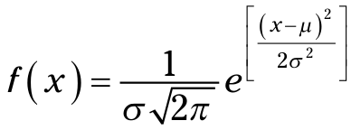

```{r setup, include=FALSE}
# git config --global user.email "madhuvasudevan@yahoo.com"
# git config --global user.name "Madhu Vasudevan"

knitr::opts_chunk$set(echo = TRUE, comment = NA)
```


```{r, message=FALSE}
#install.packages("moments")
#install.packages("tigerstats")

#z <- paste(library()$results[,1],library()$results[,2])
#z <- sort(z)
#head(z, 20)

req.lib.pkgs <- c("MASS", "ggplot2", "tigerstats")
for (req.lib in req.lib.pkgs) {
  if(! req.lib %in% (.packages())){
    library(req.lib, character.only = TRUE)
  }
}  
(.packages())
```

# What’s Normal?

## Hitting the Curve

### Digging deeper

### Parameters of a normal distribution

## Working with Normal Distributions


## Normal density function
```{r}
dnorm(100,m=100,s=15)

```

## Plotting a normal curve
```{r}
x.values <- seq(40,160,1)
sd.values <- seq(40,160,15)
zeros9 <- rep(0,9)

ggplot(NULL,aes(x=x.values,y=dnorm(x.values,m=100,s=15))) +
  geom_line() +
  labs(x="IQ",y="f(IQ)") +
  scale_x_continuous(breaks=sd.values,labels = sd.values) +
  geom_segment((aes(x=sd.values,y=zeros9,
    xend=sd.values,yend=dnorm(sd.values,m=100,s=15)))
    ,linetype = "dashed") +
  scale_y_continuous(expand = c(0,0))

```

### Cumulative density function

```{r}
pnorm(100,m=100,s=15)
pnorm(85,m=100,s=15)
pnorm(85,m=100,s=15, lower.tail = FALSE)

pnormGC(c(85,100),region="between",m=100,s=15,graph=TRUE)

```

### Plotting the cdf
```{r}
ggplot(NULL,aes(x=x.values,y=pnorm(x.values,m=100,s=15))) +
  geom_line() +
  labs(x="IQ",y="Fn(IQ)") +
  scale_x_continuous(breaks=sd.values,labels = sd.values) +
  geom_segment((aes(x=sd.values,y=zeros9,
    xend=sd.values,yend=pnorm(sd.values,m=100,s=15)))
    ,linetype = "dashed") +
  scale_y_continuous(expand = c(0,0))
```

### Quantiles of normal distributions
```{r}
qnorm(0.1586553,m=100,s=15)
qnorm(0.1586553,m=100,s=15, lower.tail = FALSE)

qnormGC(.1586553, region = "below",m=100,s=15, graph=TRUE)
qnorm(c(0,.25,.50,.75,1.00),m=100,s=15)
round(qnorm(c(.25,.50,.75),m=100,s=15))

```

### Plotting the cdf with quartiles
```{r}
q.values <-round(qnorm(c(.25,.50,.75),m=100,s=15))
zeros3 <- c(0,0,0)
ggplot(NULL,aes(x=x.values,y=pnorm(x.values,m=100,s=15))) +
  geom_line() +
  labs(x="IQ",y="Fn(IQ)") +
  scale_x_continuous(breaks=q.values,labels = q.values) +
  geom_segment((aes(x=q.values,y=zeros3,
    xend=q.values,yend=pnorm(q.values,m=100,s=15)))
    ,linetype = "dashed") +
  scale_y_continuous(expand = c(0,0))


```

### Random sampling
```{r}
rnorm(5,m=100,s=15)
rnorm(5,m=100,s=15)
set.seed(7637060)
rnorm(5,m=100,s=15)
set.seed(7637060)
rnorm(5,m=100,s=15)
```

## A Distinguished Member of the Family
```{r}
dnorm(0)
pnorm(0)
qnorm(c(.25,.50,.75))
rnorm(5)

pnormGC(c(-1,0),region="between")
qnormGC(.50, region = "below")
```

### Plotting the standard normal distribution
```{r}

```


## Scratch
```{r, include=FALSE, eval=FALSE, echo=FALSE}

```
